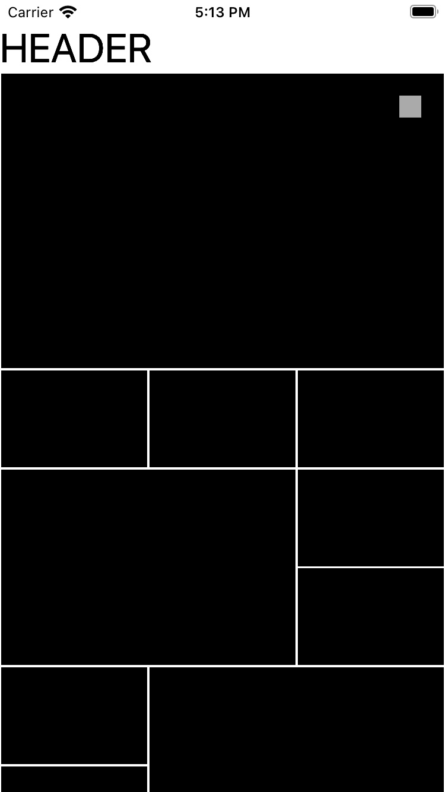
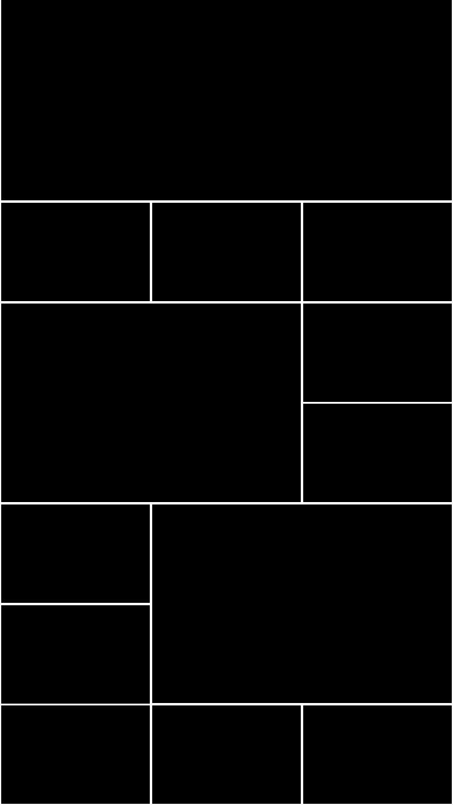
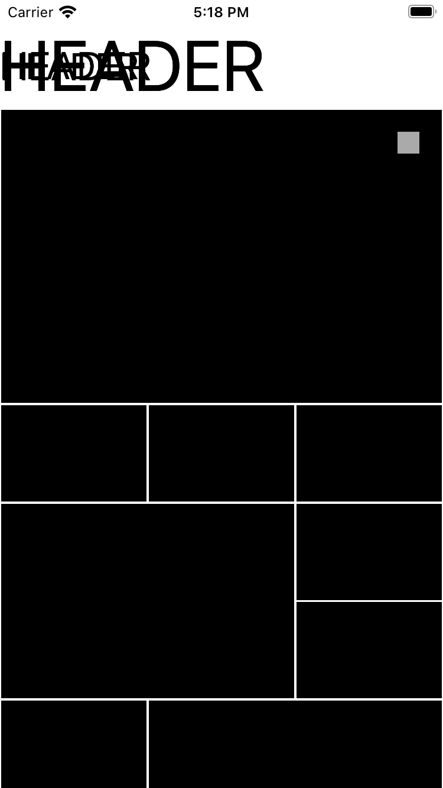

# Compositional Layouts

Example of collection view using a diffable data source and compositional layout.

	
	

## Open issues

Trying to use auto-layout for the headers, there is something wrong when changing the dynamic types' configuration.

	

## Disclaimers

The purpose of this project was only to put in practice collection view compositional layout: sections, groups, items, and the needed fractional calculations.

## References

https://www.raywenderlich.com/5436806-modern-collection-views-with-compositional-layouts
